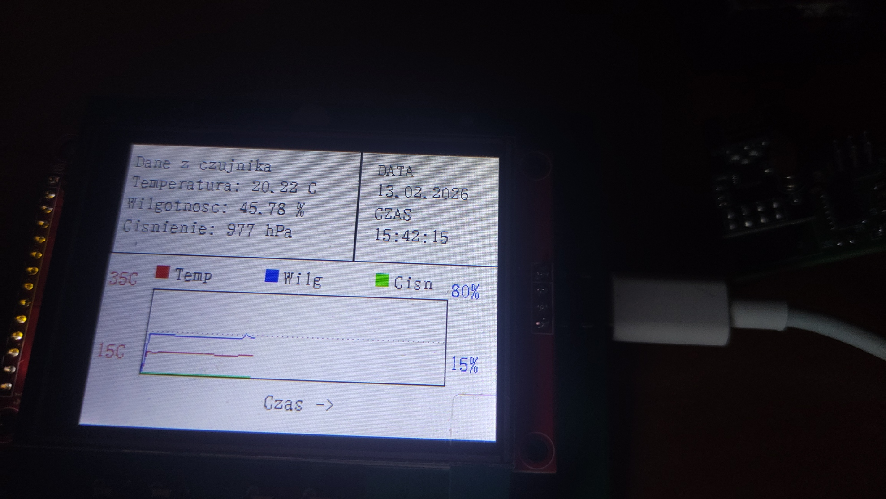

# 🌦️ Stacja Pogodowa ESP32 (Weather Station)


Projekt zaawansowanej, bezprzewodowej stacji pogodowej podzielonej na moduł bazowy (wyświetlacz) oraz zdalny węzeł czujnikowy. System monitoruje parametry środowiskowe w czasie rzeczywistym, prezentując dane na kolorowym wyświetlaczu TFT oraz rysując wykresy historyczne.


*Stacja w trakcie pracy - prezentacja aktualnych danych pomiarowych.*

## 🚀 Główne Funkcjonalności

* **Architektura Rozproszona:** Komunikacja bezprzewodowa między czujnikiem zewnętrznym a bazą przy użyciu modułów radiowych **NRF24L01** (2.4 GHz).
* **Interfejs Graficzny:** Wyświetlacz TFT LCD prezentujący:
    * Aktualną temperaturę, wilgotność i ciśnienie.
    * Wykresy historyczne (rysowanie linii w czasie rzeczywistym).
    * Aktualną datę i godzinę.
* **Synchronizacja Czasu:** Obsługa WiFi i protokołu NTP do automatycznego ustawiania zegara.
* **Sterowanie:** Fizyczne przyciski (SW1, SW2) do nawigacji między ekranami (dane liczbowe / wykresy).
* **Własne PCB:** Zaprojektowane od podstaw płytki drukowane dla obu modułów.

## 🛠️ Specyfikacja Sprzętowa (Hardware)

Projekt sprzętowy został wykonany w środowisku **KiCad**. Pliki produkcyjne znajdują się w katalogu `hardware`.

### 1. Moduł Wewnętrzny (Base Unit)
Centralna jednostka odbierająca dane i wyświetlająca wyniki.
* **MCU:** ESP32-WROOM-32E.
* **Komunikacja:** NRF24L01+ (Odbiornik) + WiFi.
* **Wyświetlacz:** TFT LCD (SPI).
* **Interfejs:** USB-C (zasilanie i programowanie przez układ CH340C).
* **PCB:** Dwuwarstwowa, elementy SMD i THT.

### 2. Moduł Zewnętrzny (Sensor Node)
Energooszczędny moduł pomiarowy.
* **MCU:** ATMEL AVR ATtiny 414.
* **Komunikacja:** NRF24L01+ (Nadajnik).
* **Czujniki:** Zintegrowany sensor środowiskowy (BME280).
* **PCB:** Kompaktowa płytka zoptymalizowana pod zasilanie bateryjne.

## 💻 Struktura Projektu (Software)

Kod źródłowy podzielony jest na dwa niezależne projekty w katalogu `software`:

```text
software/
├── external_module/        # Firmware nadajnika (zewnętrznego)
│   ├── src/                # Kod źródłowy C++
│   ├── platformio.ini      # Konfiguracja środowiska PlatformIO
│   └── ...
└── internal-module-podw/   # Firmware stacji bazowej (ESP32)
    ├── main/               # Główna logika aplikacji (ESP-IDF)
    ├── components/         # Sterowniki (LCD, NRF24, WiFi)
    ├── CMakeLists.txt      # Konfiguracja budowania ESP-IDF
    └── ...

